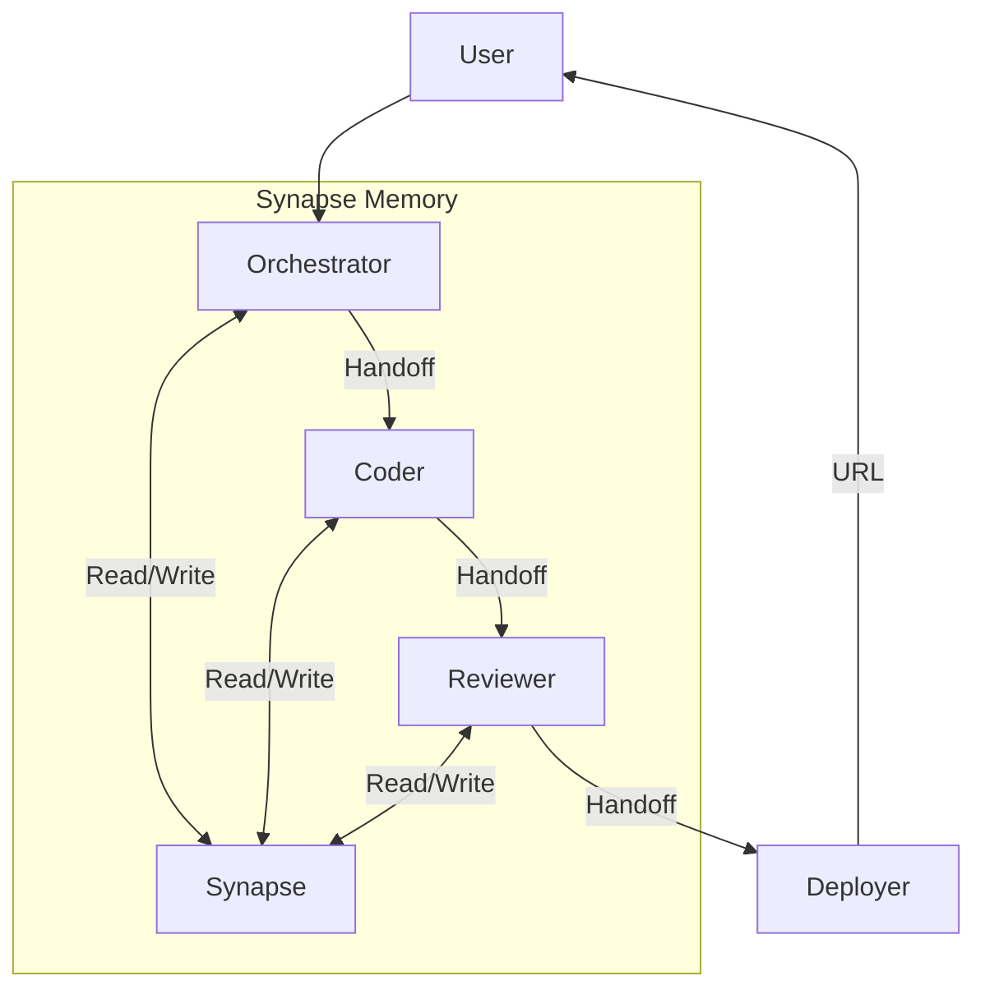

# Spec Driven Swarm Development with Neuro-symbolic Memory

A development system for creating autonomous agent infrastructures based on the Anthropic Swarm pattern, featuring persistent neuro-symbolic memory via Synapse.

## Overview

This project provides a framework for building intelligent agent swarms that can collaborate to solve complex tasks. It leverages the **Anthropic Swarm** pattern for orchestration and handoffs, and integrates **Synapse** (pmaojo/synapse-engine) for long-term memory using RDF triples. The system is designed to be spec-driven, meaning agents operate based on clear specifications and handoffs.

## Key Features

- **Anthropic Swarm Pattern**: Efficient agent orchestration with clear handoff protocols.
- **Neuro-symbolic Memory (Synapse)**: Persistent memory using RDF triples, allowing agents to store and retrieve structured knowledge.
- **Model Context Protocol (MCP)**: Standardized interface for tool use and context management.
- **Specialized Agents**:
  - **Orchestrator**: Decomposes tasks and manages the workflow.
  - **Coder**: Generates code based on specifications.
  - **Reviewer**: Validates code quality and adherence to specs.
  - **Deployer**: Handles deployment to Vercel.
  - **Memory**: Manages the knowledge graph via Synapse.
- **Deployment Ready**: Configured for deployment on Vercel.

## Architecture

The system follows a linear flow with feedback loops facilitated by shared memory:



## Prerequisites

- **Python 3.10+**
- **Node.js 18+**
- **Rust** (for building Synapse if not using pre-built binaries)
- **Vercel CLI** (for deployment)
- **Synapse Core**:
  ```bash
  cargo install synapse-core
  # Or via Docker (see scripts/synapse_docker.sh)
  ```

## Installation

1.  **Clone the repository**:
    ```bash
    git clone https://github.com/your-username/agent-swarm-dev.git
    cd agent-swarm-dev
    ```

2.  **Initialize the environment**:
    ```bash
    ./scripts/init_swarm.sh my-project
    ```

3.  **Install Python dependencies**:
    ```bash
    pip install -r requirements.txt
    ```

## Usage

### Running an Agent

To run a specific agent with a task:

```bash
./scripts/run_agent.sh orchestrator "Create a REST API for a todo list"
```

### Starting the Synapse Server

The memory system requires the Synapse server to be running:

```bash
# Start Synapse server
synapse
# Or with MCP support
synapse --mcp
```

### Deployment

Deploy the project to Vercel:

```bash
./scripts/deploy.sh
```

## Project Structure

```
agent-swarm-dev/
├── agents/               # Agent definitions and prompts
│   ├── orchestrator.md   # Orchestrator agent spec
│   ├── coder.md          # Coder agent spec
│   ├── memory.md         # Memory agent spec
│   └── reviewer.md       # Reviewer agent spec
├── scripts/              # Utility scripts
│   ├── init_swarm.sh     # Project initialization
│   ├── run_agent.sh      # Agent execution script
│   ├── deploy.sh         # Deployment script
│   ├── synapse_agent.py  # Python SDK for Synapse
│   └── synapse_mcp.py    # MCP Server implementation
├── deploy/               # Deployment configurations
│   └── vercel.json       # Vercel config
├── SKILL.md              # Skill definition for the system
├── SPEC.md               # System specification
└── README.md             # This file
```

## Contributing

Contributions are welcome! Please read `SPEC.md` for detailed specifications before submitting pull requests.

## License

[MIT License](LICENSE)
