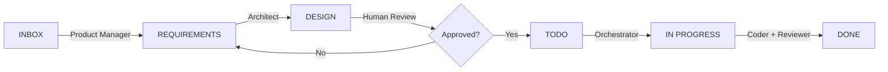

# Agent Swarm Development System

A neuro-symbolic agent swarm with graph-driven orchestration using Synapse knowledge graphs.

## 🧠 Architecture

```
┌─────────────────────────────────────────────────────────────┐
│                     User Request                              │
└──────────────────────────┬──────────────────────────────────┘
                           │
                           ▼
┌─────────────────────────────────────────────────────────────┐
│              Orchestrator Agent (Graph-Driven State Machine)    │
│  ┌──────────────────────────────────────────────────────────┐  │
│  │  1. Load Schema (YAML) → Synapse (RDF Triples)          │  │
│  │ 2. Query Graph → Determine Initial Task Type            │  │
│  │ 3. Find Handler Agent for Task                         │  │
│  │ 4. Execute Agent → Collect Result                     │  │
│  │ 5. Query Graph → Determine Next Task (on_success/failure) │  │
│  │ 6. Repeat until terminal state                         │  │
│  └──────────────────────────────────────────────────────────┘  │
└──────────────────────────┬──────────────────────────────────┘
                           │
                           ▼
┌─────────────────────────────────────────────────────────────┐
│                    Synapse Knowledge Graph                     │
│  • RDF Triples (Subject, Predicate, Object)               │
│  • SPARQL Queries for reasoning                          │
│  • Persistent memory across sessions                      │
└─────────────────────────────────────────────────────────────┘
                           │
                           ▼
┌─────────────────────────────────────────────────────────────┐
│                    Agent Swarm                               │
│  ┌──────────┐  ┌──────────┐  ┌──────────┐  ┌──────────┐  │
│  │ Orchestrator│→│   Coder   │→│ Reviewer │→│ Deployer │  │
│  └──────────┘  └──────────┘  └──────────┘  └──────────┘  │
└─────────────────────────────────────────────────────────────┘
```

## 🚀 Quick Start

### 1. Install Dependencies

```bash
# Python dependencies
pip install fastembed flask grpcio-tools synapse-sdk pyyaml openai pylint flake8 bandit tenacity

# Synapse binary (light mode)
# Download from https://github.com/synapse-engine/synapse/releases
```

### 2. Start Services

```bash
# Terminal 1: Start Synapse (light mode - RAM + remote embeddings)
./synapse

# Terminal 2: Start FastEmbed server (optional, for embeddings)
python scripts/embeddings_server.py --port 11434
```

### 3. Run Swarm

```bash
# Run the full graph-driven swarm flow
python3 scripts/swarm_flow.py "Create a REST API"

# Run with verbose output
python3 scripts/swarm_flow.py "Implement user authentication" --verbose
```

## 🤖 Autonomous GSD Workflow (Trello + OpenSpec)

This system implements a fully autonomous "Get Shit Done" (GSD) workflow driven by Trello state transitions and OpenSpec documents.

### The "Ping-Pong" Workflow

The swarm operates through a continuous feedback loop between three specialized agents, using Trello lists as the state machine and the file system (OpenSpec) as the source of truth.

| Stage | Agent | Action | Transition |
|---|---|---|---|
| **INBOX** | 🧠 **Product Manager** | Reads user idea, generates `openspec/specs/.../spec.md`, and links it to the card. | Moves to `REQUIREMENTS` |
| **REQUIREMENTS** | 📐 **Architect** | Reads `spec.md`, generates Technical Design (`openspec/changes/.../design.md`), and updates card. | Moves to `DESIGN` |
| **DESIGN** | 🛑 **Human-in-the-Loop** | **WAITING FOR APPROVAL**. A human must review the Design and apply the `[APPROVED]` label. | Manual Move to `TODO` |
| **TODO** | 🏗️ **Orchestrator** | Detects `[APPROVED]` label, executes the implementation (Coder -> Reviewer), and verifies against Spec. | Moves to `DONE` |

### 🛡️ NIST Guardrails

To ensure safety and alignment, the **Orchestrator** enforces a strict policy:
*   It will **ONLY** execute tasks from the `TODO` list if the Trello card has the **`[APPROVED]`** label.
*   This acts as a mandatory "Human-in-the-Loop" checkpoint, preventing the swarm from writing code without explicit authorization of the design.

### State Diagram



## 📋 Schema Definition

The swarm behavior is defined in `swarm_schema.yaml`:

```yaml
agents:
  Orchestrator: "Coordinates task flow and manages state."
  Coder: "Implements features and writes code."
  Reviewer: "Reviews code for quality and spec adherence."
  Deployer: "Deploys the application."

tasks:
  FeatureImplementationTask:
    handler: Coder
    description: "Implement a feature based on a specification."
  CodeReviewTask:
    handler: Reasoner
    description: "Review the implemented code."
  DeploymentTask:
    handler: Deployer
    description: "Deploy the verified code."

transitions:
  FeatureImplementationTask:
    on_success: CodeReviewTask
    on_failure: FeatureImplementationTask
  CodeReviewTask:
    on_success: DeploymentTask
    on_failure: FeatureImplementationTask
  DeploymentTask:
    on_success: null
    on_failure: DeploymentTask
```

## 🔄 Graph-Driven Orchestration

The Orchestrator uses a **state machine** based on the knowledge graph:

1. **Load Schema**: YAML → Synapse (RDF triples)
2. **Query Graph**: SPARQL → Find initial task type
3. **Find Handler**: Query → Get responsible agent
4. **Execute Agent**: Run agent → Collect result
5. **Determine Next**: Query → Get next task (on_success/on_failure)
6. **Repeat**: Until terminal state

### Example Flow

```
User: "Create a REST API"
  ↓
Orchestrator: Query graph → Initial: FeatureImplementationTask
  ↓
Handler: Coder
  ↓
Result: success → Query graph → Next: CodeReviewTask
  ↓
Handler: Reviewer
  ↓
Result: success → Query graph → Next: DeploymentTask
  ↓
Handler: Deployer
  ↓
Result: success → Terminal state
```

## 🧪 Testing

```bash
# Test the graph reasoning flow
python3 scripts/test_flow.py

# Test embeddings
python3 scripts/test_embeddings.py

# Test Synapse connection
python3 scripts/simple_synapse_client.py
```

## 🔧 Configuration

### Environment Variables

| Variable | Default | Description |
|----------|---------|-------------|
| `LLM_MODEL` | `gpt-4` | Model for agent execution |
| `OPENAI_API_KEY` | - | OpenAI API key |
| `SYNAPSE_GRPC_HOST` | `localhost` | Synapse gRPC host |
| `SYNAPSE_GRPC_PORT` | `50051` | Synapse gRPC port |
| `EMBEDDING_PROVIDER` | `local` | Use `remote` for FastEmbed |
| `EMBEDDING_API_URL` | `http://localhost:11434/api/embeddings` | Embeddings endpoint |

### Synapse (Light Mode)

```bash
# Build light mode
cargo build --release --no-default-features -p synapse-core

# Run with remote embeddings
EMBEDDING_PROVIDER=remote ./target/release/synapse
```

## 📦 Components

| Component | Description |
|-----------|-------------|
| `synapse` | Graph DB (RDF triples) |
| `embeddings_server.py` | FastEmbed HTTP API |
| `agents/orchestrator.py` | Graph-driven orchestration |
| `scripts/swarm_flow.py` | End-to-end swarm execution |
| `swarm_schema.yaml` | Swarm behavior definition |
| `scripts/test_flow.py` | Graph reasoning tests |

## 🧠 Neuro-Symbolic Memory

The swarm combines:
- **Symbolic**: RDF triples, SPARQL queries, ontologies
- **Neural**: Vector embeddings for semantic search
- **Graph**: Knowledge graph for reasoning and state management

## 📝 Adding New Agents

1. Add agent to `swarm_schema.yaml`:
```yaml
agents:
  YourAgent:
    description: "Your agent description."

tasks:
  YourTask:
    handler: YourAgent
    description: "Your task description."

transitions:
  YourTask:
    on_success: NextTask
    on_failure: YourTask
```

2. Implement agent in `agents/your_agent.py`:
```python
from orchestrator import OrchestratorAgent

class YourAgent:
    def execute(self, task: str, context: Dict) -> Dict:
        # Your agent logic here
        return {"status": "success", "result": "..."}
```

## 📊 Monitoring

The Orchestrator logs each step:
```
🚀 Orchestrator starting task: Create a REST API
📍 Step: FeatureImplementationTask → Handler: Coder
🤖 Agent 'Coder' executing: Create a REST API
✅ Reviewer approved the code.
🔄 Transition: FeatureImplementationTask (success) → CodeReviewTask
🏁 Workflow Complete
```

## 🤝 Contributing

1. Fork the repository
2. Create a feature branch
3. Update `swarm_schema.yaml` for new agents/tasks
4. Add tests in `scripts/test_*.py`
5. Submit a pull request

## 📄 License

MIT

## 🙏 Acknowledgments

- **Synapse**: Neuro-symbolic knowledge graph engine
- **FastEmbed**: Lightweight vector embeddings
- **Anthropic**: Swarm orchestration patterns
